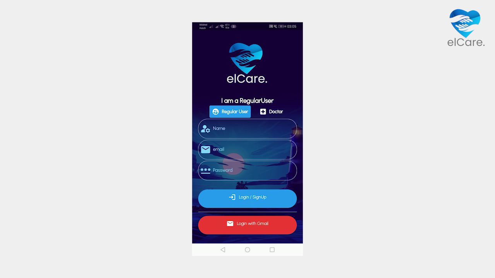
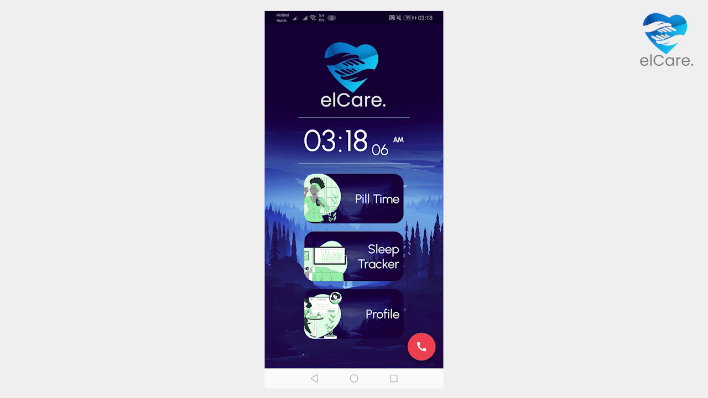
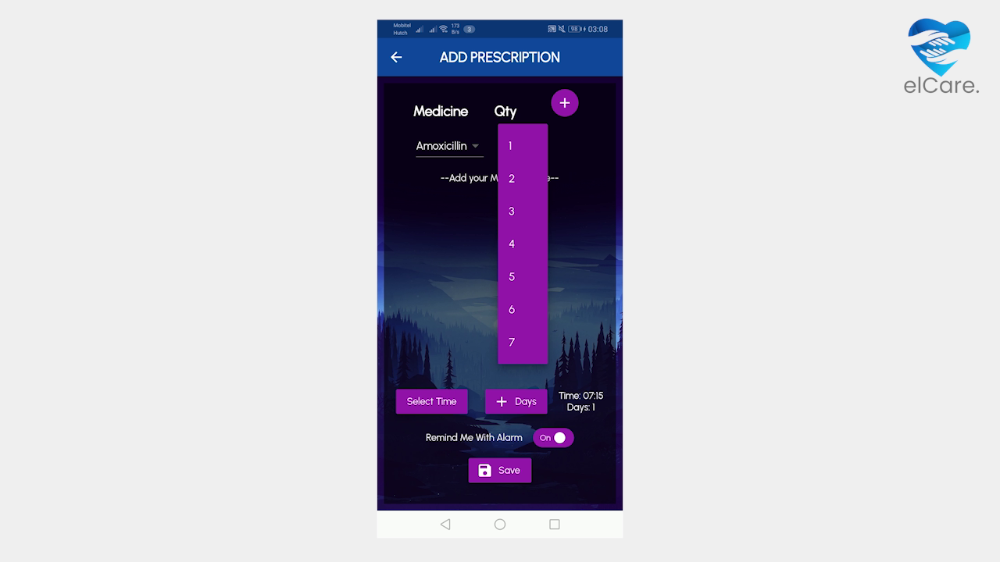
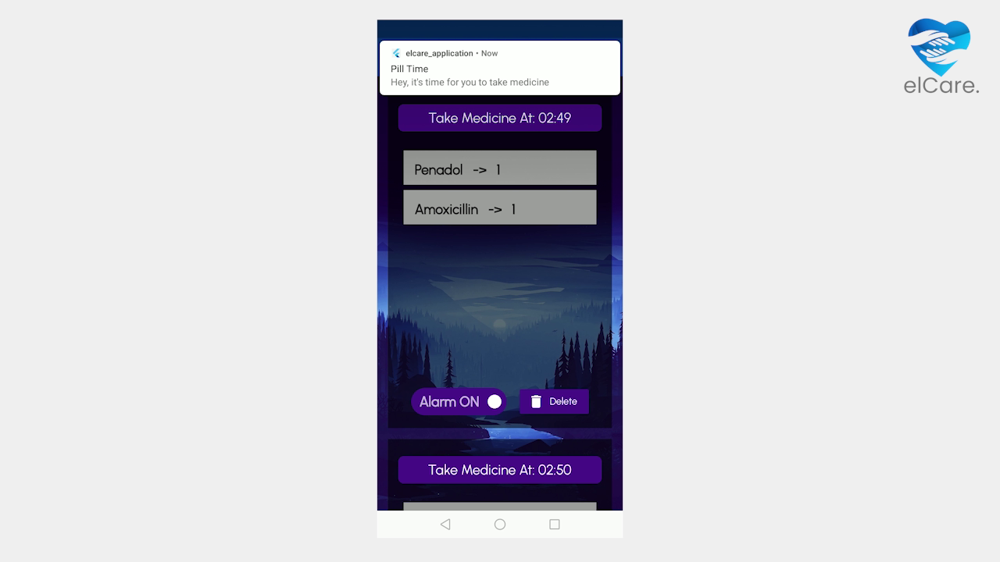
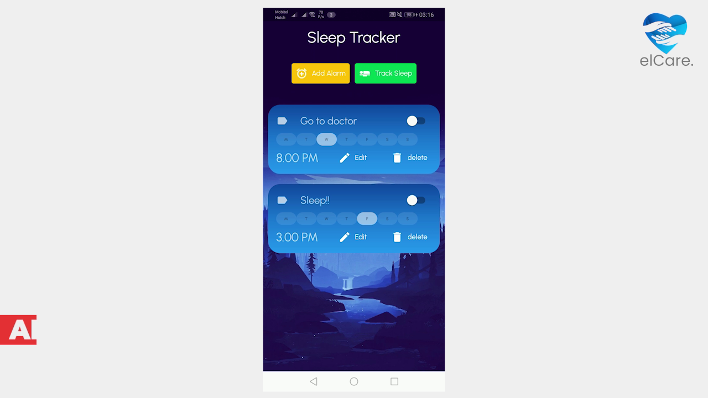
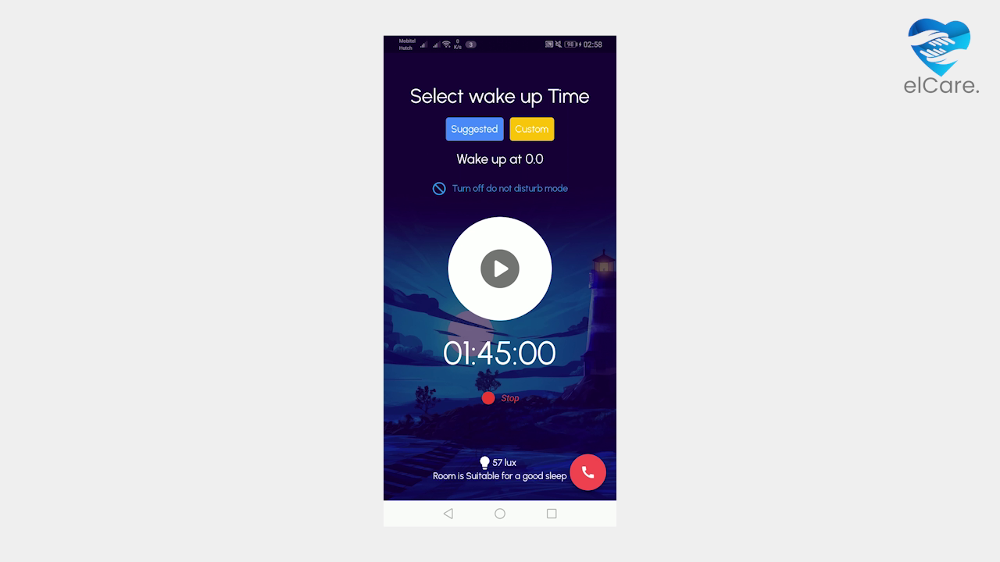
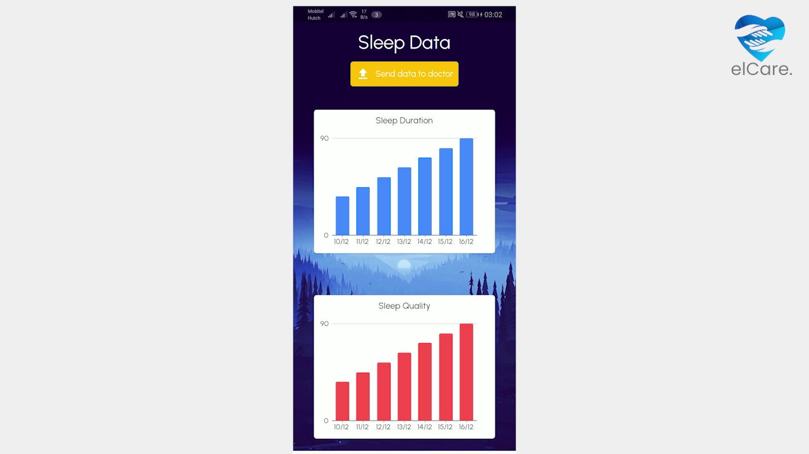
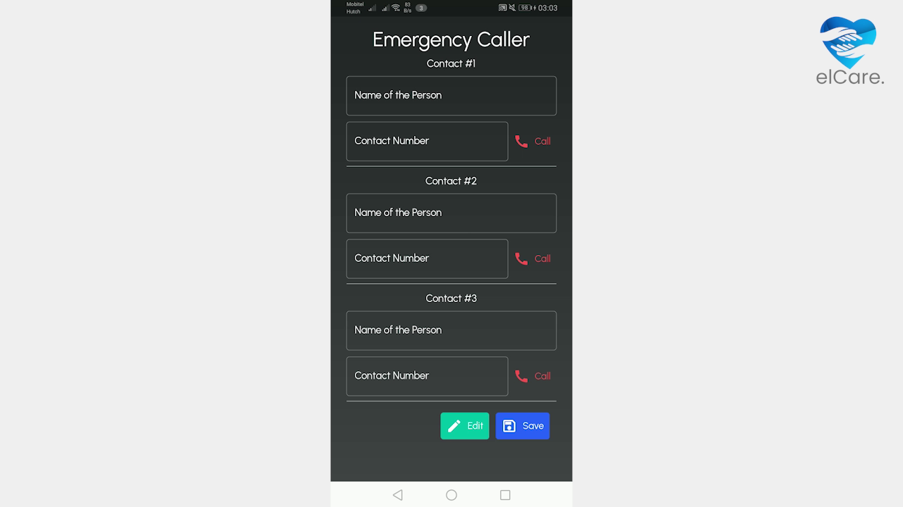
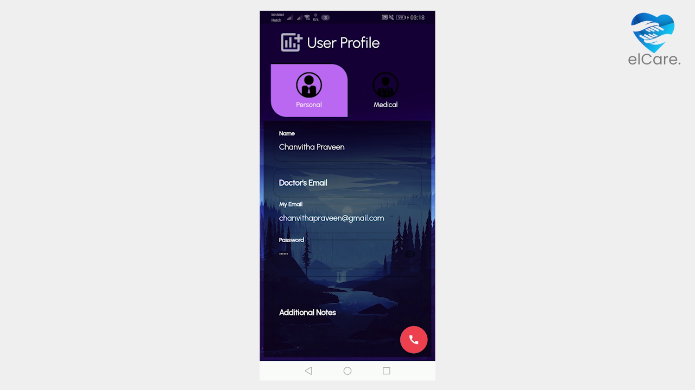

<h1 align="center">
   
  
   
  elCare
   
</h1>

<h4 align="center">A Mobile Application for the Elderly</h4>

  
  
  
  
  
  

   
  <a href="#description">Description</a> •
  <a href="#components">Components</a> •
  <a href="#contributors">Contributors</a>

## Description
‘Elcare’ is a mobile application specifically developed for the senior citizens. Through this application, the senior citizens will be assisted in managing their daily aspects to help them to live burden free life. The senior citizens can receive digital assistance through this application where they will be assisted to easily manage their medical routines, Emergency situations, sleep deprivation and to reach the family doctor and share their medical information.

## Components
- Login

 
This is the first interface that loads when the user starts the app for the first time. The user has to select the role, a regular user or a doctor. Then there are two methods to log into the app. Simple login function and login with gmail account function. When login with gmail is tapped the user can select the gmail account. After selecting that, if the user is new, he will be added to the firebase firestore. Then he can go to the relevant account screen by pressing the button or logout using the logout button.
 
When using the normal login method, the user has to enter the name, email and password. This uses regex validations. Then when the login button is tapped, if the user is already in the system his password will be checked and will be redirected to the relevant screen. Otherwise the user will be added to the firebase firestore and redirected to the relevant screen. This is a one time login. The user can always logout if wanted. All the login details are saved in local shared preferences.

- Regular User Interface

 
This is the regular user page and there are the options to select which are pill timer, sleep tracker, profile and finally the emergency caller button.

- Pill Timer

 
 
There are four buttons to go through each and every functionalities in the main pill time interface. First option is to add prescriptions. Here you can create whatever number of prescriptions you want to get in the day. In a single prescription, there are two dropdown lists to select your medicine variety and number of pills you want to take at that prescription time. After selecting the medicine and quantity, then click the add button to add that into your prescription. In the same way you can add other medicines also. Then select the time you want to notify by the alarm and days of the prescription valid. Then save it. The alarm will ring and at that time we can note it clearly.
 
When the alarm rings notification will appear to check whether user has taken medicines at the particular time. If he enters ‘yes’ on the popup ,related medicine quantities in the medicine store will update accordingly.
 
Second option of the pill timer is view prescription option. Here you can view all the prescriptions you have added related to a day. Medicine quantities related to a prescription is shown here. You can also set the pill timer alarm on or off. Finally there is another option to delete a particular prescription.
 
 
Third option of pill timer  is adding a new medicine. You should give name, quantity and a description for the medicine if you want. Also we have added some inbuilt medicine types for the ease of the user. You can also set the image for the medicine from the gallery or camera.
 
 
Final option of the pill timer is the medicine store. Here you can see all the medicines and their remaining quantities. You can update the quantity through the add quantity option if you have bought new medicine. Number of medicines available in the medicine store is also shown. Another key feature in this is showing how many days remaining medicines will be enough.

- Alarm

 

 
This is basically the sleep tracker interface. Here, the user can manually add alarms as he or she prefers. When the add alarm button is pressed, the user will be navigated to another interface which is used to add a new alarm as well as to edit the alarm. In it, the user can input a purpose, pick a time to set the alarm, give the decision whether he wants to vibrate or not when the alarm is triggered,  select preferred weekdays to trigger the alarm, and so on. Then when the confirm button is pressed a new alarm card will be there with the given details. The user can add any number of alarms. Next to add alarm button, track sleep button can be located. It will be discussed later. In each alarm card, the user can activate or deactivate the alarm using a switch button. If the user wants to edit an existing alarm, he or she can use the edit option. If the user wants to delete an existing alarm card, the delete option is there.

- The Sleep Tracker

 
When the user taps the track sleep button, he or she  is navigated to the sleep tracking function. There the user can track the sleep quality and duration. To get started, the user has to select the time that he wants to wake up. To do this, there are two options. First the suggested time by us and the manual time input by the user. 
When the suggested button is tapped it suggests 5 different time values where he can wake up. These values are calculated based on sleep cycles to ensure a quality sleep and refreshed wake up.
If he wants to input the time manually, It is also available. When the button is pressed, the user can set the that he wants to wake up.
The user can automatically turn on “Don’t disturb mode by tapping the button”. If the user is using this for the first time, the permission has to be given. After that when the button is pressed, it will auto enable the ‘Don’t disturb mode’.
 
The user can see whether the ambient light of the room is suitable for a good sleep at the bottom of the screen. This is calculated using the light sensors of the mobile phone. This uses scientifically used lux values to determine the ambient light quality.
 
Now all is set, when the user presses the start button, it starts tracking the sleep until the timer is finished or the user pressed the stop button.
Once the timer is finished or the stop button is pressed, the mobile’s currently set alarm will ring and the sleep data will be saved to the hive database.
Then the user can see his sleep quality which is calculated using a three part equation.
 

 

All the sleep data can be seen under the user profile screen’s medical tab. 
This has two charts. One for sleep quality and other for sleep duration.
When the upload button is pressed, all the sleep data is sent to the doctor via firebase.
 

- The Emergency Caller

 
The emergency call button appears in every main interface. When clicked it navigates to the emergency caller interface. If there is no emergency number saved, when any of the call buttons are pressed, a dialog will tell the user to dial the number manually. Then the dialpad appears. When the number is pressed, the call can be made. The user can save the emergency contact numbers beforehand by tapping the edit button. Then the person can directly call those numbers. All the contact data is saved in local hive database

- User Profile

 
In the main menu, the user can see his name at the top. The user has to connect the
Arduino system to the computer to get the data about the soil moisture level of the plant.
The soil moisture sensor is connected to the plant. The application shows whether the
current soil moisture level of the plant is good or bad for the plant. Other than that the
user can navigate to different functions using the given buttons.

- Doctor Interface

 
Next, we will look into the doctor's functionalities. From the loading screen after selecting the mode of entry, if the user type is selected as a doctor, the doctor's home interface will be loaded. Here, the name of each patient is displayed on a card. When the view details button is tapped, it will open an interface, showing two buttons. the ‘sleep Tracker details’ button will open another interface to display the details related to that person’s sleep quality. Similarly, the pill timer details button will display the user’s taken medicine records. All patient details are obtained through a cloud storage that interlinks the user and doctor. let’s move back to the doctor's home interface. from the bottom of the patient list, the doctor can add a new patient to the list. on the bottom right is another button used to load the doctor’s profile page, which display’s the doctor’s details which are updatable or can also log out from our ‘Elcare’ Application.

## Contributors

